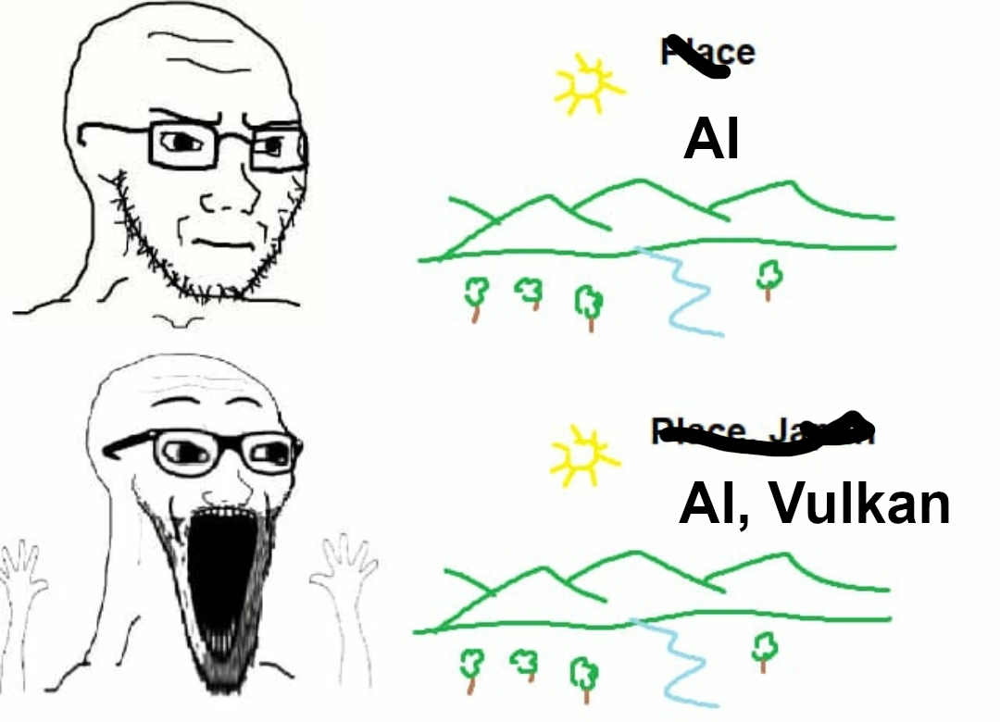

# vkgrad

[tinygrad](https://github.com/tinygrad/tinygrad) but in Vulkan(o).

## Current status

- [ ] Low level tensor API
  - [ ] Matrix multiplication (current speed: GPU 3 TFLOPS, CPU 0.7-0.8 FLOPS)
    - [x] Baseline naive compute shader implementation.
    - [ ] Optimized compute shader implementation.
    - [ ] KhrCoopMat compute shader implementation.
    - [ ] NvCoopMat2 compute shader implementation.
- [ ] High level tensor API
- [ ] Neural network API

## Issues

- [x] Compute shader matmul sometimes give wrong results on certain shapes.
- [x] Compute shader currently assumes row-major layout.

## References

[vk_cooperative_matrix_perf](https://github.com/jeffbolznv/vk_cooperative_matrix_perf)
